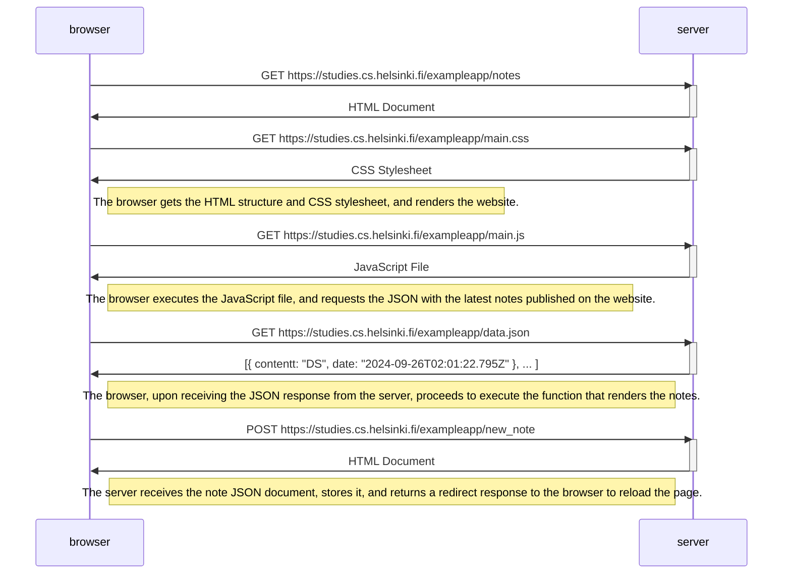

```mermaid
sequenceDiagram
    participant browser
    participant server

    browser->>server: GET https://studies.cs.helsinki.fi/exampleapp/notes
    activate server
    server->>browser: HTML Document
    deactivate server

    browser->>server: GET https://studies.cs.helsinki.fi/exampleapp/main.css
    activate server
    server->>browser: CSS Stylesheet
    deactivate server

    Note right of browser: The browser gets the HTML structure and CSS stylesheet, and renders the website.

    browser->>server: GET https://studies.cs.helsinki.fi/exampleapp/main.js
    activate server
    server->>browser: JavaScript File
    deactivate server

    Note right of browser: The browser executes the JavaScript file, and requests the JSON with the latest notes published on the website.

    browser->>server: GET https://studies.cs.helsinki.fi/exampleapp/data.json
    activate server
    server->>browser: [{ contentt: "DS", date: "2024-09-26T02:01:22.795Z" }, ... ]
    deactivate server

    Note right of browser: The browser, upon receiving the JSON response from the server, proceeds to execute the function that renders the notes.

    browser->>server: POST https://studies.cs.helsinki.fi/exampleapp/new_note 
    activate server
    server->>browser: HTML Document
    deactivate server

    Note left of server: The server receives the note JSON document, stores it, and returns a redirect response to the browser to reload the page.
```