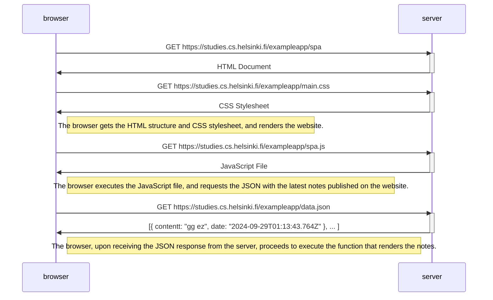

```mermaid
sequenceDiagram
    participant browser
    participant server

    browser->>server: GET https://studies.cs.helsinki.fi/exampleapp/spa
    activate server
    server->>browser: HTML Document
    deactivate server

    browser->>server: GET https://studies.cs.helsinki.fi/exampleapp/main.css
    activate server
    server->>browser: CSS Stylesheet
    deactivate server

    Note right of browser: The browser gets the HTML structure and CSS stylesheet, and renders the website.

    browser->>server: GET https://studies.cs.helsinki.fi/exampleapp/spa.js
    activate server
    server->>browser: JavaScript File
    deactivate server

    Note right of browser: The browser executes the JavaScript file, and requests the JSON with the latest notes published on the website.

    browser->>server: GET https://studies.cs.helsinki.fi/exampleapp/data.json
    activate server
    server->>browser: [{ contentt: "gg ez", date: "2024-09-29T01:13:43.764Z" }, ... ]
    deactivate server

    Note right of browser: The browser, upon receiving the JSON response from the server, proceeds to execute the function that renders the notes.  
```